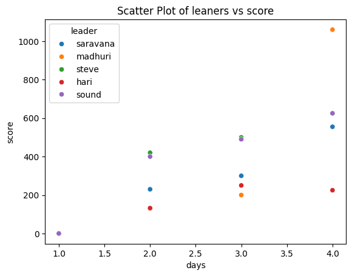
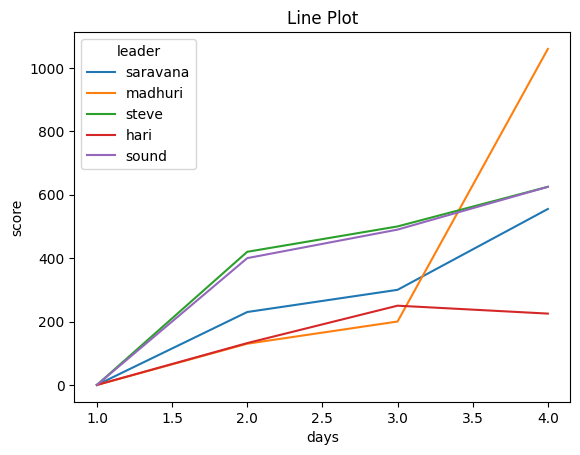
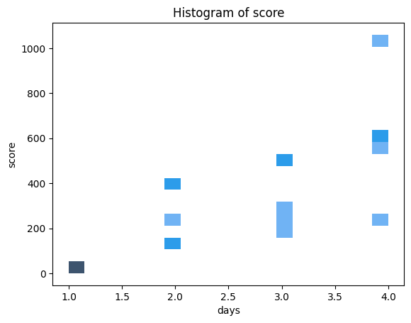
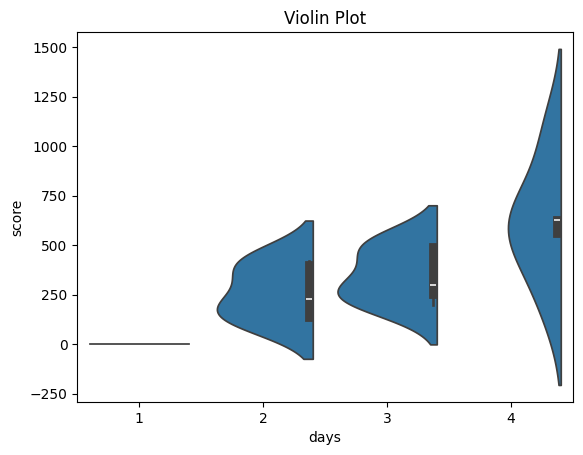
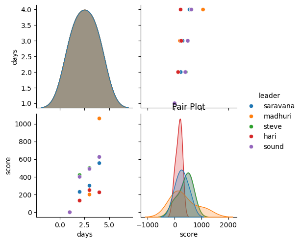
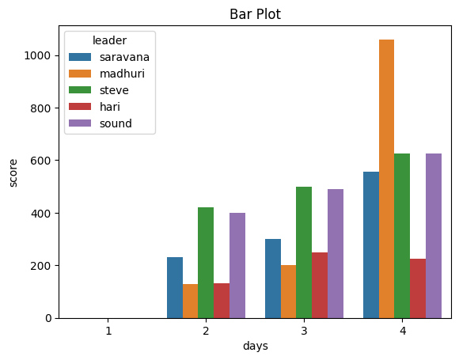
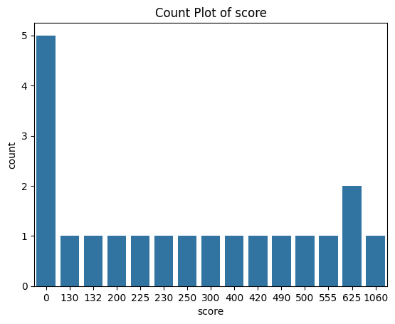

```python
#import the neccessary libraries
```


```python
import seaborn as sns
import matplotlib.pyplot as plt
import pandas as pd
```


```python
#create a variable to store number of days
```


```python
day_list = [
    1,1,1,1,1,
    2,2,2,2,2,
    3,3,3,3,3,
    4,4,4,4,4
]
```


```python
#create a variable to store the scores
```


```python
score_list = [
    0,0,0,0,0,
    230,130,420,132,400,
    300,200,500,250,490,
    555,1060,625,225,625
]
```


```python
#create a variable to store the names
```


```python
leaners = [
    'saravana','madhuri','steve','hari','sound',
    'saravana','madhuri','steve','hari','sound',
    'saravana','madhuri','steve','hari','sound',
    'saravana','madhuri','steve','hari','sound'
]
```


```python
#create a variable to connect the all above variables
```


```python
data = {
    'days'   : day_list,
    'score'  : score_list,
    'leader' : leaners
}
```


```python
df = pd.DataFrame(data)
```


```python
df
```


<div>
<style scoped>
    .dataframe tbody tr th:only-of-type {
        vertical-align: middle;
    }

    .dataframe tbody tr th {
        vertical-align: top;
    }

    .dataframe thead th {
        text-align: right;
    }
</style>
<table border="1" class="dataframe">
  <thead>
    <tr style="text-align: right;">
      <th></th>
      <th>days</th>
      <th>score</th>
      <th>leader</th>
    </tr>
  </thead>
  <tbody>
    <tr>
      <th>0</th>
      <td>1</td>
      <td>0</td>
      <td>saravana</td>
    </tr>
    <tr>
      <th>1</th>
      <td>1</td>
      <td>0</td>
      <td>madhuri</td>
    </tr>
    <tr>
      <th>2</th>
      <td>1</td>
      <td>0</td>
      <td>steve</td>
    </tr>
    <tr>
      <th>3</th>
      <td>1</td>
      <td>0</td>
      <td>hari</td>
    </tr>
    <tr>
      <th>4</th>
      <td>1</td>
      <td>0</td>
      <td>sound</td>
    </tr>
    <tr>
      <th>5</th>
      <td>2</td>
      <td>230</td>
      <td>saravana</td>
    </tr>
    <tr>
      <th>6</th>
      <td>2</td>
      <td>130</td>
      <td>madhuri</td>
    </tr>
    <tr>
      <th>7</th>
      <td>2</td>
      <td>420</td>
      <td>steve</td>
    </tr>
    <tr>
      <th>8</th>
      <td>2</td>
      <td>132</td>
      <td>hari</td>
    </tr>
    <tr>
      <th>9</th>
      <td>2</td>
      <td>400</td>
      <td>sound</td>
    </tr>
    <tr>
      <th>10</th>
      <td>3</td>
      <td>300</td>
      <td>saravana</td>
    </tr>
    <tr>
      <th>11</th>
      <td>3</td>
      <td>200</td>
      <td>madhuri</td>
    </tr>
    <tr>
      <th>12</th>
      <td>3</td>
      <td>500</td>
      <td>steve</td>
    </tr>
    <tr>
      <th>13</th>
      <td>3</td>
      <td>250</td>
      <td>hari</td>
    </tr>
    <tr>
      <th>14</th>
      <td>3</td>
      <td>490</td>
      <td>sound</td>
    </tr>
    <tr>
      <th>15</th>
      <td>4</td>
      <td>555</td>
      <td>saravana</td>
    </tr>
    <tr>
      <th>16</th>
      <td>4</td>
      <td>1060</td>
      <td>madhuri</td>
    </tr>
    <tr>
      <th>17</th>
      <td>4</td>
      <td>625</td>
      <td>steve</td>
    </tr>
    <tr>
      <th>18</th>
      <td>4</td>
      <td>225</td>
      <td>hari</td>
    </tr>
    <tr>
      <th>19</th>
      <td>4</td>
      <td>625</td>
      <td>sound</td>
    </tr>
  </tbody>
</table>
</div>


```python
df.pivot(index = 'days', columns = 'leader',values = 'score')
```


<div>
<style scoped>
    .dataframe tbody tr th:only-of-type {
        vertical-align: middle;
    }

    .dataframe tbody tr th {
        vertical-align: top;
    }

    .dataframe thead th {
        text-align: right;
    }
</style>
<table border="1" class="dataframe">
  <thead>
    <tr style="text-align: right;">
      <th>leader</th>
      <th>hari</th>
      <th>madhuri</th>
      <th>saravana</th>
      <th>sound</th>
      <th>steve</th>
    </tr>
    <tr>
      <th>days</th>
      <th></th>
      <th></th>
      <th></th>
      <th></th>
      <th></th>
    </tr>
  </thead>
  <tbody>
    <tr>
      <th>1</th>
      <td>0</td>
      <td>0</td>
      <td>0</td>
      <td>0</td>
      <td>0</td>
    </tr>
    <tr>
      <th>2</th>
      <td>132</td>
      <td>130</td>
      <td>230</td>
      <td>400</td>
      <td>420</td>
    </tr>
    <tr>
      <th>3</th>
      <td>250</td>
      <td>200</td>
      <td>300</td>
      <td>490</td>
      <td>500</td>
    </tr>
    <tr>
      <th>4</th>
      <td>225</td>
      <td>1060</td>
      <td>555</td>
      <td>625</td>
      <td>625</td>
    </tr>
  </tbody>
</table>
</div>


```python
#Scatter Plot - Used to display relationships between two continuous variables.
```


```python
sns.scatterplot(data=df, x='days', y='score', hue='leader')
plt.title("Scatter Plot of leaners vs score")
plt.show()
```


    

    


```python
# Line Plot - Used for trends or time-series data.
```


```python
sns.lineplot(data=df, x='days', y='score', hue='leader')
plt.title("Line Plot")
plt.show()

```


    

    


```python
#Histogram - Visualize the distribution of a single variable.
```


```python
sns.histplot(data=df, x='days', y = 'score', bins=20, kde=True)
plt.title("Histogram of score")
plt.show()

```


    

    


```python
#Box Plot - Shows the distribution of data and highlights outliers.
```


```python
sns.boxplot(data=df, x='days', y='score')
plt.title("Box Plot")
plt.show()

```


    

    


```python
#violin plot - Combines a box plot with a kernel density plot.
```


```python
sns.violinplot(data=df, x='days', y='score', split=True)
plt.title("Violin Plot")
plt.show()

```


    

    


```python
#Pair Plot- Displays scatter plots for all numerical columns in the dataset.
```


```python
sns.pairplot(df, hue='leader')
plt.title("Pair Plot")
plt.show()

```


    

    


```python
#Bar Plot - Shows categorical data as bars.
```


```python
sns.barplot(data=df, x='days', y='score', hue='leader')
plt.title("Bar Plot")
plt.show()

```


    

    


```python
#Count Plot - Counts the occurrences of each category.
```


```python
sns.countplot(data=df, x='score')
plt.title("Count Plot of score")
plt.show()

```


    

    


```python

```


---
**Score: 30**
