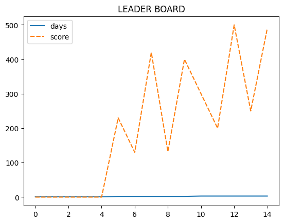

```python
#import neccessary libraries
```


```python
import pandas as pd
```


```python
import seaborn as sns
```


```python
#!pip install seaborn
```


```python
#create a variable to store number of days
```


```python
day_list = [
    1,1,1,1,1,
    2,2,2,2,2,
    3,3,3,3,3
]
```


```python
#create a variable to store the scores
```


```python
score_list = [
    0,0,0,0,0,
    230,130,420,132,400,
    300,200,500,250,490
]
```


```python
#create a variable to store the names
```


```python
leaners = [
    'saravana','madhuri','steve','hari','sound',
    'saravana','madhuri','steve','hari','sound',
    'saravana','madhuri','steve','hari','sound',
]
```


```python
#create a variable to connect the all above variables
```


```python
data = {
    'days'   : day_list,
    'score'  : score_list,
    'leader' : leaners
}
```


```python
#call the dataframe
```


```python
df = pd.DataFrame(data)
```


```python
df
```


<div>
<style scoped>
    .dataframe tbody tr th:only-of-type {
        vertical-align: middle;
    }

    .dataframe tbody tr th {
        vertical-align: top;
    }

    .dataframe thead th {
        text-align: right;
    }
</style>
<table border="1" class="dataframe">
  <thead>
    <tr style="text-align: right;">
      <th></th>
      <th>days</th>
      <th>score</th>
      <th>leader</th>
    </tr>
  </thead>
  <tbody>
    <tr>
      <th>0</th>
      <td>1</td>
      <td>0</td>
      <td>saravana</td>
    </tr>
    <tr>
      <th>1</th>
      <td>1</td>
      <td>0</td>
      <td>madhuri</td>
    </tr>
    <tr>
      <th>2</th>
      <td>1</td>
      <td>0</td>
      <td>steve</td>
    </tr>
    <tr>
      <th>3</th>
      <td>1</td>
      <td>0</td>
      <td>hari</td>
    </tr>
    <tr>
      <th>4</th>
      <td>1</td>
      <td>0</td>
      <td>sound</td>
    </tr>
    <tr>
      <th>5</th>
      <td>2</td>
      <td>230</td>
      <td>saravana</td>
    </tr>
    <tr>
      <th>6</th>
      <td>2</td>
      <td>130</td>
      <td>madhuri</td>
    </tr>
    <tr>
      <th>7</th>
      <td>2</td>
      <td>420</td>
      <td>steve</td>
    </tr>
    <tr>
      <th>8</th>
      <td>2</td>
      <td>132</td>
      <td>hari</td>
    </tr>
    <tr>
      <th>9</th>
      <td>2</td>
      <td>400</td>
      <td>sound</td>
    </tr>
    <tr>
      <th>10</th>
      <td>3</td>
      <td>300</td>
      <td>saravana</td>
    </tr>
    <tr>
      <th>11</th>
      <td>3</td>
      <td>200</td>
      <td>madhuri</td>
    </tr>
    <tr>
      <th>12</th>
      <td>3</td>
      <td>500</td>
      <td>steve</td>
    </tr>
    <tr>
      <th>13</th>
      <td>3</td>
      <td>250</td>
      <td>hari</td>
    </tr>
    <tr>
      <th>14</th>
      <td>3</td>
      <td>490</td>
      <td>sound</td>
    </tr>
  </tbody>
</table>
</div>


```python
df.pivot(index = 'days', columns = 'leader',values = 'score')
```


<div>
<style scoped>
    .dataframe tbody tr th:only-of-type {
        vertical-align: middle;
    }

    .dataframe tbody tr th {
        vertical-align: top;
    }

    .dataframe thead th {
        text-align: right;
    }
</style>
<table border="1" class="dataframe">
  <thead>
    <tr style="text-align: right;">
      <th>leader</th>
      <th>hari</th>
      <th>madhuri</th>
      <th>saravana</th>
      <th>sound</th>
      <th>steve</th>
    </tr>
    <tr>
      <th>days</th>
      <th></th>
      <th></th>
      <th></th>
      <th></th>
      <th></th>
    </tr>
  </thead>
  <tbody>
    <tr>
      <th>1</th>
      <td>0</td>
      <td>0</td>
      <td>0</td>
      <td>0</td>
      <td>0</td>
    </tr>
    <tr>
      <th>2</th>
      <td>132</td>
      <td>130</td>
      <td>230</td>
      <td>400</td>
      <td>420</td>
    </tr>
    <tr>
      <th>3</th>
      <td>250</td>
      <td>200</td>
      <td>300</td>
      <td>490</td>
      <td>500</td>
    </tr>
  </tbody>
</table>
</div>


```python
sns.lineplot(data=df)
```


    <Axes: >


    

    


```python
sns.lineplot(data=df).set(title='LEADER BOARD')
```


    [Text(0.5, 1.0, 'LEADER BOARD')]


    

    


```python
sns.lineplot(data=df, x = 'days', y = 'score')
```


    <Axes: xlabel='days', ylabel='score'>


    

    


```python

```


---
**Score: 20**
