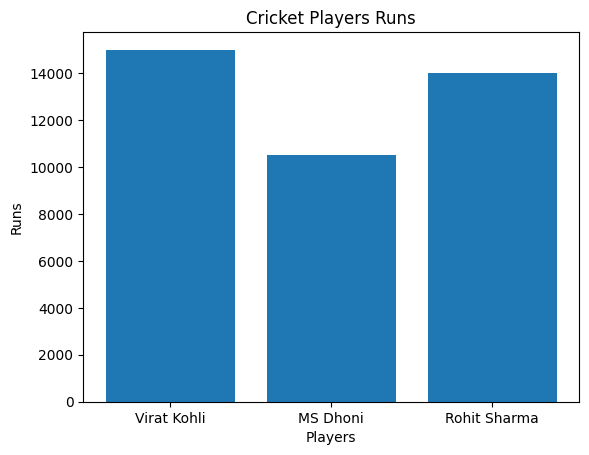

```python
import matplotlib.pyplot as plt
```


```python
def cric_score():
    players = ["Virat Kohli", "MS Dhoni", "Rohit Sharma"]
    runs = [15000, 10500, 14000]
    
    plt.bar(players, runs)
    plt.title("Cricket Players Runs")
    plt.xlabel("Players")
    plt.ylabel("Runs")
    plt.show()
```


```python
print(cric_score())
```


    

    


    None


```python

```


---
**Score: 0**
