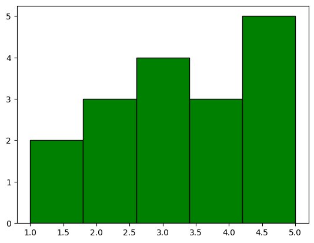
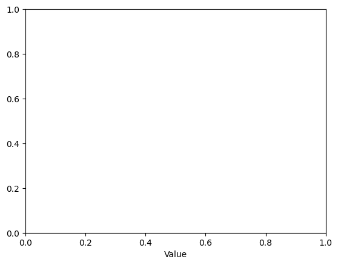
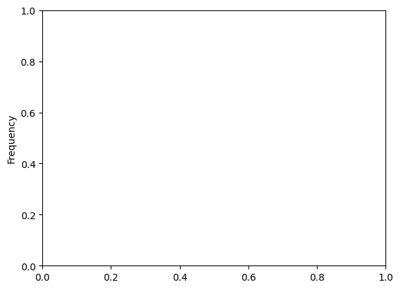
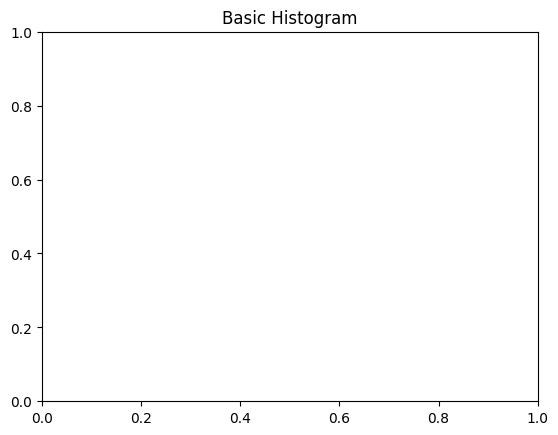

```python
#Import Matplotlib
```


```python
import matplotlib.pyplot as plt
```


```python
#data definition
```


```python
data = [1, 1, 2, 2, 2, 3, 3, 3, 3, 4, 4, 4, 5, 5, 5, 5, 5]
```


```python
#Creating the Histogram
```


```python
plt.hist(data, bins=5, color='green', edgecolor='black')
```


    (array([2., 3., 4., 3., 5.]),
     array([1. , 1.8, 2.6, 3.4, 4.2, 5. ]),
     <BarContainer object of 5 artists>)


    

    


```python
#Adding X-Axis Label
```


```python
plt.xlabel("Value")
```


    Text(0.5, 0, 'Value')


    

    


```python
#Adding Y-Axis Label
```


```python
plt.ylabel("Frequency")
```


    Text(0, 0.5, 'Frequency')


    

    


```python
#Adding a Title
```


```python
plt.title("Basic Histogram")
```


    Text(0.5, 1.0, 'Basic Histogram')


    

    


```python
#run the Plot
```


```python
plt.show()
```


```python

```


---
**Score: 15**
